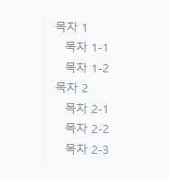
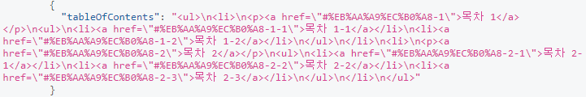
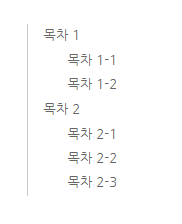
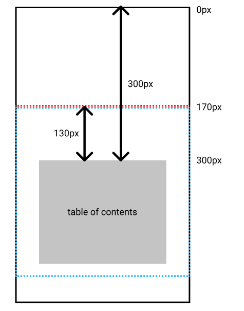

gatsby 블로그에 table of contents를 추가해 보았다. table of contents는 목차를 의미하는데 위 사진처럼 velog나 tistory같은 블로그 서비스에서 글 왼쪽에 문서의 소제목들을 묶어서 링크를 걸어주는 것들이 table of contents이다.

개인적으로 [velog](https://velog.io/)에서 제공하는 table of contents가 가장 깔끔하고 보기 좋아서 velog의 것을 본따서 만들었다. velog의 table of contents는 게시물의 오른쪽에서 게시물과 같이 스크롤 되다가 일정 높이 아래로는 내려가지 않고 고정되어있는데, 자세히 보니 평상시에는 position이 absolute로 설정되어 있다가 일정 높이 아래로 스크롤 되면 position을 fixed로 설정하는 방식으로 만들어져있었다.

### 게시물에서 목차 추출하기

table of contents를 처음 만드려고 할땐 cheerio를 이용해서 게시물의 html을 정제해 소제목들을 뽑아낼 생각이었는데, 알고보니 gatsby에서는 친절하게도 각 포스트마다의 table of contents를 html 태그로 제공해주고 있다.

```
{
  allMarkdownRemark {
    nodes {
      tableOfContents
    }
  }
}
```

이런식으로 쿼리하면 ul과 li, a태그로 이루어진 html코드를 손쉽게 얻을 수 있는데, 이미 h1\~h6 태그들이 각각 li로 대입되어 있고, anchor기능이 a태그로 만들어져 있는 코드라 별다른 추가 과정없이 바로 table of contents로 사용이 가능하다.



쿼리한 html을 사용하기 위해 TableOfContents 컴포넌트를 만들었다. 게시물 페이지를 만들어주는 BlogPost template에서 게시물의 제목, 내용, 날짜 등과 함께 table of contents를 같이 쿼리하고 쿼리한 table of contents를 이 컴포넌트에 props로 넘겨 사용할 것이다.

### component 만들기

gatsby에서 table of contents에 담길 html을 제공해주기 때문에 우리는 이 html을 그대로 보여주기만 하면 된다. TableOfContents 컴포넌트를 만들고 gatsby에서 제공해준 html을 그대로 보여줄 수 있도록 props로 html을 받고 받은 html을 innerHTML로 그대로 전달했다.

```tsx
// components/toc.tsx
interface TableOfContentsProps {
  html: string
}
const TableOfContents = ({ html }: TableOfContentsProps) => {
  return (
    <div className="toc_wrapper">
      <div dangerouslySetInnerHTML={{ __html: html }}></div>
    </div>
  )
}
```

만든 컴포넌트를 게시물 페이지를 만들어주는 BlogPostTemplate에 import해서 적용시켰다.

```tsx
// templates/blog-post.tsx
const BlogPostTemplate = ({ data }) => {
  const tableOfContents = data.markdownRemark.tableOfContents
  return (
    <main>
      <article>
        ...
        <TableOfContents html={tableOfContents} />
        ...
      </article>
    </main>
  )
}
export default BlogPostTemplate
export const pageQuery = graphql`
  query BlogPost(
    $id: String!
  )
    markdownRemark(id: { eq: $id }) {
      ...
      tableOfContents
      ...
    }
  }
`
```

### anchor 적용시키기

일반적으로 table of contents의 소제목을 누르게 되면 해당 내용의 시작지점으로 페이지가 이동한다. 이렇게 한 페이지내에 링크를 만들어 해당 섹션으로의 이동을 간편하게 만들어 주는 기능을 anchor라고 한다.

anchor기능은 이동하고자 하는 섹션에 id를 적용하고 a태그의 목적지를 해당 id로 적용함으로써 구현이 가능하다. 예를들어 아래 코드의 경우 #section-1를 목적지로 하는 이동-1이라는 텍스트를 누르게 되면 해당 페이지의 id가 section-1인 부분으로 이동할 수 있다.

```html
<a href="#section-1">이동-1</a>
<a href="#section-2">이동-2</a>
...
<h1 id="section-1">제목 1</h1>
...
<h1 id="section-2">제목 2</h1>
```

gatsby에 table of contents를 쿼리해서 받은 html에도 a태그에 링크가 걸려있는데 각 소제목에 적용될 id들이 인코딩된 값들이다. 그러나 링크가 걸려있음에도 table of contents의 소제목들을 눌러도 아무런 반응이 없는데, 각 섹션의 제목에 id가 적용되어있지 않기 때문이다.

다행히 이 문제를 위한 gatsby plugin이 이미 준비되어 있다. [gatsby-remark-autolink-headers](https://www.gatsbyjs.com/plugins/gatsby-remark-autolink-headers/) 플러그인을 활용해 게시물의 h1\~h6 태그에 각각 id를 걸어줄 수 있다.

플러그인을 npm으로 설치하고 gatsby-config.js에 등록해 플러그인을 사용할 수 있다. 이때 gatsby-remark-autolink-headers은 gatsby-transformer-remark 플러그인의 sub plugin이기 때문에 gatsby-config.js에서 gatsby-transformer-remark의 options에 추가해야 한다.

```
npm install gatsby-remark-autolink-headers
```

```
// gatsby-config.js
module.exports = {
  plugins: [
    {
      resolve: `gatsby-transformer-remark`,
      options: {
        plugins: [`gatsby-remark-autolink-headers`],
      },
    },
  ],
}
```

플러그인을 적용시키면 h1\~h6 태그에 id가 적용되어 table of contents의 소제목을 클릭했을때 해당 섹션으로 스크롤 이동이 가능해진다.

### style 적용하기

#### position

TableOfContents 컴포넌트는 게시물 내용을 담고있는 article 태그 안쪽에 위치하고있는데, style이 적용되지 않은 TableOfContents 컴포넌트는 다른 div들 처럼 게시물 안쪽에 위치게 된다. table of contents를 게시물 오른쪽으로 옮기고 아래에 있는 나머지 게시물 내용을 그만큼 위로 끌어 올릴 수 있도록 아래처럼 css를 적용시켰다.

우선 Element를 이동시키기 위해서 .toc_wrapper의 position을 absolute로 설정했다. 이때 position absolute는 position이 relative, absolute, fixed 중 하나인 가장 가까운 부모 Element를 기준으로 움직이게 되는데, article태그의 position을 relative로 설정함으로써 .toc_wrapper의 기준을 article태그로 설정했다.

table of contents를 게시물 오른쪽으로 이동시킨다는 말은 TableOfContents를 오른쪽으로 article태그의 width만큼 이동시킨다는 말과 동치이다. .toc_wrapper의 left를 100%로 적용시키면 오른쪽으로 article태그의 width만큼 이동해 게시물 오른쪽에 위치하게 된다.

```css
article {
  position: relative;
}

.toc_wrapper {
  position: absolute;
  left: 100%;
}
```

#### 나머지

깔끔한 모양새를 위해 나머지 style도 변경해준다.

```css
li > ul {
  margin-left: 1.5rem;
}

.toc_wrapper > div {
  width: 12rem;
  margin-left: 2rem;
  padding-left: 1rem;
  border-left: 1px solid #cacaca;
  overflow: hidden;
}

.toc_wrapper * {
  list-style: none;
  text-decoration: none;
  font-family: Nanum Gothic;
  color: #848484;
  margin-top: 0;
  margin-bottom: 1rem;
}
```

style이 적용되면 아래 사진처럼 바뀐다.


### 스크롤 처리하기

지금까지 만든 table of contents은 position absolute이기 때문에 스크롤과 상관없이 항상 같은 자리에 위치하고 있다. 그래서 현재는 게시물을 읽으면서 스크롤을 내리게 되면 table of contents가 viewport 위로 올라가 보이지 않게 되는데 스크롤을 내려도 table of contents를 계속 viewport상에 위치시키면서 페이지 아랫쪽에서도 계속 사용할 수 있게 만들어주는것이 더 바람직해보인다.

velog의 경우 이 문제를 해결하기 위해 table of contents의 position을 absolute를 기본값으로 적용시키면서, 일정수준 스크롤을 내리게 되면 position을 fixed로 변경해 더이상 table of contents가 올라가지 않고 계속 화면에 남도록 만들었다. 이 방식을 모사해서 스크롤을 내려도 table of contents가 스크롤을 따라 계속 올라가지 않고 viewport 상단에서 130px 아래 위치까지만 올라가 고정되도록 만들어보았다.

우선 평상시 position absolute인 table of contents의 position을 얼마나 스크롤 되었을때 fixed로 변경할 것인지 정해야 한다. 아래 사진의 검은 실선부분이 페이지 전체이고 파란 점선 부분이 현재 화면에 보여지고 있는 부분인 viewport라고 할때 아래로 스크롤해도 viewport의 상단에서 130px 아래 위치까지만 올라가도록 하기 위해서는 table of contents가 페이지 최상단에서 부터 떨어져 있는 거리에서 130px을 뺀 위치인 빨간 점선을 경계로 position을 변경해주면 된다. 즉, 예시로 table of contents가 페이지 최상단에서 300px 아래에 위치하고 있는 경우에는 0\~170px만큼 스크롤 되었을땐 postion을 absolute로, 그보다 많이 스크롤 되었을땐 fixed로 설정해주면 된다.



스크롤 위치에 따라 table of contents의 position 속성을 변경해야할지 판단하기 위해선 현재 스크롤 위치와 table of contents가 페이지 최상단과 떨어져 있는 거리를 구해야 한다. 현재 스크롤 위치는 window.scrollY로 손쉽게 구할 수 있고, table of contents가 페이지 최상단으로부터 떨어져있는 거리는 페이지 최상단으로 부터 현재 화면으로 보고있는 viewport까지의 거리와 viewport 상단을 기준으로 table of contents까지의 거리의 합으로 구할 수 있다. 이때 페이지 최상단으로부터 viewport까지의 거리는 스크롤한 길이와 동치이기 때문에 window.scrollY로 구할 수 있고 viewport를 기준으로 DOM Element의 상대좌표를 구할 수 있게 해주는 [getBoundingClientRect](https://developer.mozilla.org/ko/docs/Web/API/Element/getBoundingClientRect)함수를 이용해 구할 수 있다. 이렇게 현재 스크롤 위치와 table of contents의 위치를 구하고 handleScroll 함수를 작성할 수 있다.

앞서 작성한 handleScroll 함수를 각 스크롤 이벤트마다 실행해주면 되는데, useEffect hook을 이용해 mount시에 scroll eventlistener를 등록하고 unmount때 해제해 해결할 수 있다.

```tsx
import React, { useRef, useEffect } from "react"

interface TableOfContentsProps {
  html: string
}

const TableOfContents = ({ html }: TableOfContentsProps) => {
  const ref = useRef<HTMLDivElement>(null)
  const initialOffset = useRef<number>()
  const fixedPosition = 130

  const handleScroll = () => {
    if (window.scrollY > initialOffset.current! - fixedPosition) {
      ref.current!.style.position = "fixed"
      ref.current!.style.top = `${fixedPosition}px`
    } else {
      ref.current!.style.position = ""
      ref.current!.style.top = ""
    }
  }

  useEffect(() => {
    initialOffset.current =
      ref.current!.getBoundingClientRect().top + window.scrollY
    handleScroll()
    window.addEventListener("scroll", handleScroll)
    return () => {
      window.removeEventListener("scroll", handleScroll)
    }
  }, [])

  return (
    <div className="toc_wrapper">
      <div ref={ref} dangerouslySetInnerHTML={{ __html: html }}></div>
    </div>
  )
}

export default TableOfContents
```

#### font loading

여기까지 작성한 코드를 블로그에 적용시켰을 때 움직임에 약간의 어색함이 있었다. 로그를 출력해보니 실제로 table of contents의 위치가 원래 위치 좌표보다 크게 계산되었었는데 TableOfContents 컴포넌트가 아래 순서대로 실행되면서 생긴 문제였다.

1. 컴포넌트가 render된다. 이때, header에 적용된 font-family에서 1순위로 정의된 글씨체를 아직 다운로드 받는 중이기 때문에 응답이 오기 전까지 우선 2순위로 적용된 글씨체가 적용된다. 2순위로 적용된 글씨체가 비교적 자간이 넓은 글씨체여서 header가 두줄로 렌더링 되었다.
2. render가 끝난 뒤, useEffect hook에 정의된 effect함수를 실행되어 table of contents의 위치가 계산되었다.
3. font-family에 1순위로 정의된 글씨체가 모두 다운로드 되고 header의 글씨가 다운받은 글씨체로 변경되었다. 이 글씨체가 이전에 적용된 글씨체보다 자간이 좁기때문에 header가 한줄로 줄어들었다.

DOM이 정의될때 header가 TableOfContents보다 앞서 정의 되었기때문에 header의 높이가 달라지면 TableOfContents의 높이도 그만큼 달라지게 된다. 이에 따라 effect 함수가 실행될때 두줄이었던 header 텍스트가 폰트 다운로드 이후에 한줄로 변경되면서 텍스트 한줄의 높이만큼 계산값에 차이가 발생하게 된 것이었다.

effect함수가 mount될때 처리하던 내용들을 font resource가 모두 loading된 이후에 처리되도록 변경시키면 해결되는 문제라 [font.ready](https://developer.mozilla.org/en-US/docs/Web/API/Document/fonts)의 콜백함수에 기존에 mount될때 실행되어야 하는 내용들을 적용해 해결했다.

```tsx
import React, { useRef, useEffect } from "react"

interface TableOfContentsProps {
  html: string
}

const TableOfContents = ({ html }: TableOfContentsProps) => {
  const ref = useRef<HTMLDivElement>(null)
  const initialOffset = useRef<number>()
  const fixedPosition = 130

  const handleScroll = () => {
    if (window.scrollY > initialOffset.current! - fixedPosition) {
      ref.current!.style.position = "fixed"
      ref.current!.style.top = `${fixedPosition}px`
    } else {
      ref.current!.style.position = ""
      ref.current!.style.top = ""
    }
  }

  useEffect(() => {
    document.fonts.ready.then(() => {
      initialOffset.current =
        ref.current!.getBoundingClientRect().top + window.scrollY
      handleScroll()
      window.addEventListener("scroll", handleScroll)
    })
    return () => {
      document.fonts.onloadingdone = null
      window.removeEventListener("scroll", handleScroll)
    }
  }, [])

  return (
    <div className="toc_wrapper">
      <div ref={ref} dangerouslySetInnerHTML={{ __html: html }}></div>
    </div>
  )
}

export default TableOfContents
```

#### throttle

throttle은 일정 시간내에 같은 이벤트가 여러번 일어나지 않게 제어하는 방법이다. 스크롤 이벤트는 짧은 시간내에 굉장히 많은 수의 이벤트를 발생시키는데 복잡한 콜백함수가 적용되어 있을 경우 화면이 멈추거나 느려지는 성능 저화를 일으킬 수 있기 때문에 스크롤 이벤트는 throttle로 제어하는 경우가 많다.

throttle을 사용하기 위해 lodash를 설치하고 handleScroll 함수를 throttle로 감싼 throttledHandleScroll를 정의해 스크롤 event listener의 콜백함수를 throttledHandleScroll를로 바꿔주었다. throttle의 두번째 인자가 100이기 때문에 100ms동안 여러번의 함수 호출이 일어나도 한번의 호출만 일어나도록 제어된다.

```tsx
import React, { useRef, useEffect } from "react"
import { throttle } from "lodash"

interface TableOfContentsProps {
  html: string
}

const TableOfContents = ({ html }: TableOfContentsProps) => {
  const ref = useRef<HTMLDivElement>(null)
  const initialOffset = useRef<number>()
  const fixedPosition = 130

  const handleScroll = () => {
    if (window.scrollY > initialOffset.current! - fixedPosition) {
      ref.current!.style.position = "fixed"
      ref.current!.style.top = `${fixedPosition}px`
    } else {
      ref.current!.style.position = ""
      ref.current!.style.top = ""
    }
  }
  const throttledHandleScroll = throttle(handleScroll, 100)

  useEffect(() => {
    document.fonts.ready.then(() => {
      initialOffset.current =
        ref.current!.getBoundingClientRect().top + window.scrollY
      handleScroll()
      window.addEventListener("scroll", throttledHandleScroll)
    })
    return () => {
      document.fonts.onloadingdone = null
      window.removeEventListener("scroll", throttledHandleScroll)
    }
  }, [])

  return (
    <div className="toc_wrapper">
      <div ref={ref} dangerouslySetInnerHTML={{ __html: html }}></div>
    </div>
  )
}

export default TableOfContents
```
