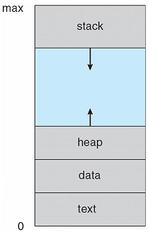
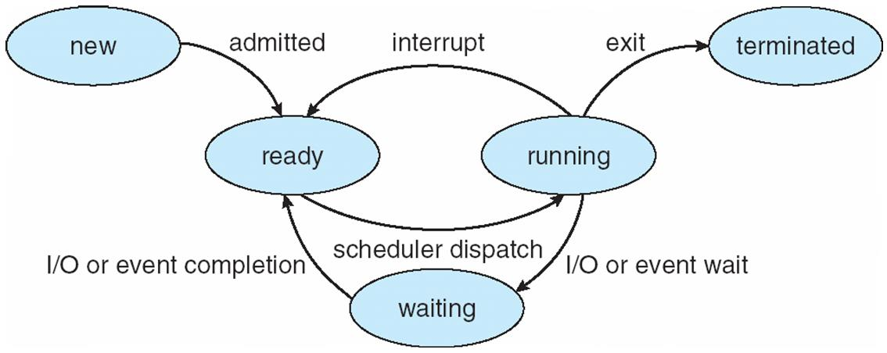
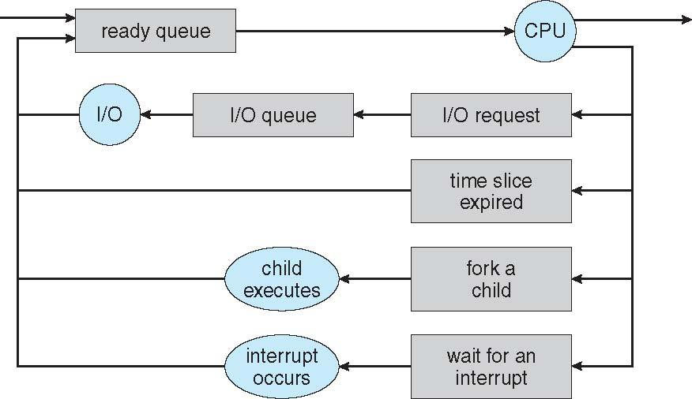
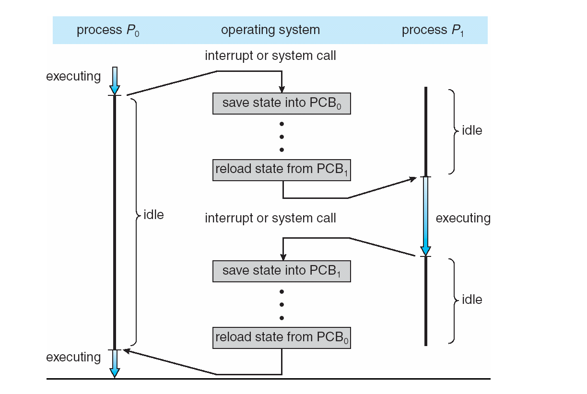

### Process Concept

#### Definition of Process

- A program in execution
- An execution stream in the context of a particular process state

특정 상태(context)를 가지는 프로그램의 실행 흐름(execution stream)

#### Context

- memory context

  - stack segment (local variable, parameters, return address..)
  - heap (동적할당)
  - data segment (global variable)
  - text(code) segment

- hardware context

  - cpu registers, I/O registers

- system context
  - process table, file table, page table

#### Multi-programming, Multi-processing

- Uni-programming

  - Only one process in memory at a time
  - Mostly old OS

- Multi-programming (memory 관점)

  - Multiple processes in memory
  - Most systems support multi-programming

- Multi-processing (cpu 관점)
  - Multiple processes are running together at the same time
  - cpu is multiplexed

#### Process control block

multi-processing에서 OS는 프로세스의 진행상태를 저장해야함.
각 프로세스에 대해 아래의 정보를 PCB에 저장함.

- Process state
- Program counter
- Registers
- Scheduling information
- Memory management information
- Accounting information
- I/O status information

PCB들은 process table에 저장됨.

### Process state

#### Process state

PCB에 저장되는 process state는 위 그림의 5가지 상태 중 하나를 나타냄

- new: the process is being created
- ready: the process is waiting to be assigned to a processor
- running: instruction are being executed
- waiting: the process is waiting for some event to occur
- terminated: the process has finished execution

#### State transition

여러 state에 있는 프로세스들은 각 state에 맞는 queue에 저장되어서 관리됨.

예를 들어, cpu를 점유할 수 있는 상태의 프로세스를 담는 ready queue, I/O의 완료를 기다리고 있는 I/O queue, 시스템의 모든 프로세스를 담고있는 job queue 등이 있음

#### Scheduler

- cpu scheduler (short-term scheduler)

  - 어떤 프로세스가 다음에 cpu를 점유해서 실행될지 결정하는 스케줄러
  - 자주 실행됨(milliseconds 수준)

- job scheduler (long-term scheduler)
  - 어떤 프로세스를 ready queue에 넣을지 결정
  - 자주 실행되지는 않는다(seconds, minutes 수준)
  - multi programming의 정도를 조절해 저장할 memory context가 너무 많은 경우를 방지
  - cpu bound process와 I/O bound process를 적당히 조합해 성능을 끌어올려야 함
  - 최근 OS에는 없는 경우도 있다

#### Context Switching

cpu scheduler가 cpu를 점유하고 있는 프로세스를 교체할 때 기존 프로세스의 context를 save하고 새로운 프로세스의 context를 load하는 과정을 context switching이라고 함. context switching에 쓰이는 시간은 overhead임.
