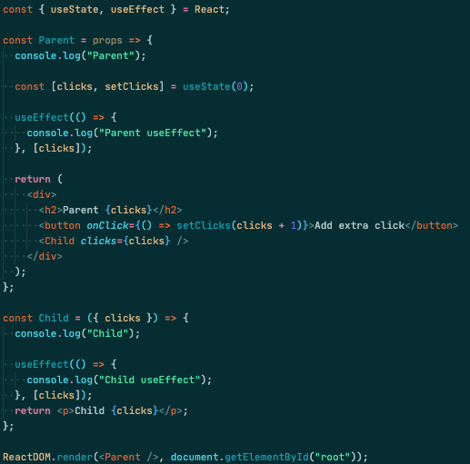
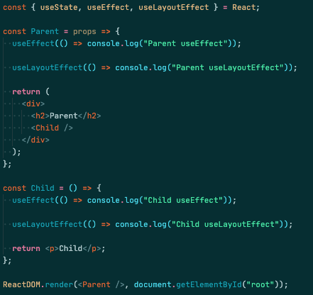
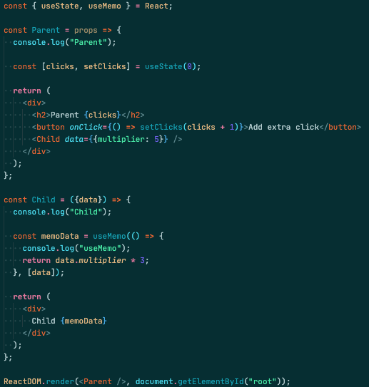
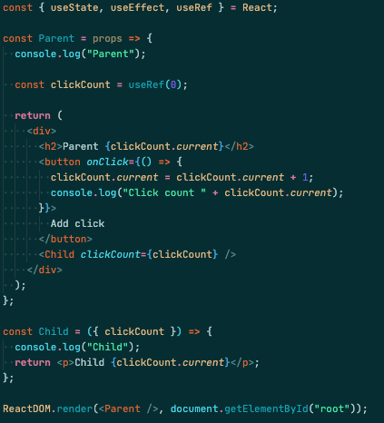
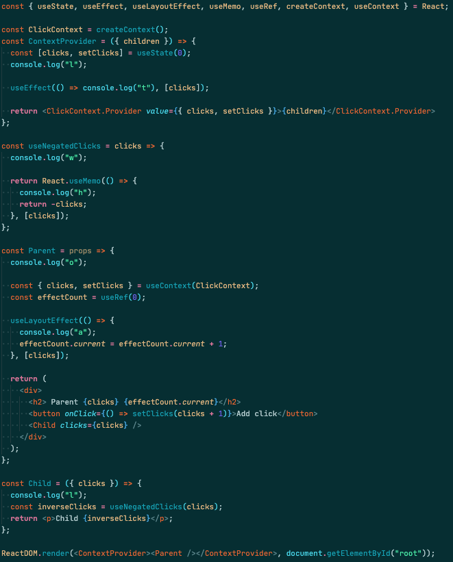

우연치 않게 [React Hooks Quiz](https://docs.google.com/forms/d/e/1FAIpQLSdAG7QtzNT_-rl6j1bqJpJaq-5ZaLR_hnWUGvtVCR4vD5O_sA/viewform)를 풀었는데 생각보다 헷갈리는 부분들이 많아서 정리해보았다.

### 1번문제

부모, 자식 컴포넌트간 실행순서와 useEffect hooks에서 effect 함수가 언제 실행되는지 묻는 문제이다. 부모, 자식 컴포넌트간 실행순서는 각 컴포넌트가 자바스크립트 함수로서 Parent함수에서 Child 함수를 호출하는 방식이기 때문에 부모 > 자식 순서대로 실행된다. 또한 useEffect hook의 effect함수는 컴포넌트가 렌더링을 마친 이후에 실행되며, 부모 컴포넌트는 자식 컴포넌트의 렌더링이 완료된 이후에 렌더링되기 때문에 Child 컴포넌트가 렌더링 된 이후 Child함수의 effect함수가 실행되고, 이후 Parent 컴포넌트가 렌더링을 마치고나서 Parent 컴포넌트의 effect함수가 실행된다.

따라서 답은, Parent, Child, Child useEffect, Parent useEffect 이다.

### 2번문제

useEffect hook과 useLayoutEffect hook의 실행순서를 묻는 문제이다. useEffect hook과 useLayoutEffect hook은 컴포넌트가 렌더링된 이후에 실행됨은 같지만, useEffect가 DOM update와 paint이후에 effect함수를 실행시키는것과 달리 useLayoutEffect의 effect함수는 DOM update이후, paint 이전에 실행된다. 따라서 useEffect의 effect함수가 DOM 구조에 영향을 주게 되어 화면의 깜빡임이 일어나게 되는경우 useLayoutEffect가 해결방법이 될 수 있다. 문제에서 주어진 코드에서는 Child 컴포넌트의 DOM update 이후 Parent 컴포넌트의 DOM update가 뒤이어 일어나고, 모든 DOM update가 완료된 뒤 Child 컴포넌트의 paint 이후 Parent 컴포넌트의 paint가 이루어진다.

답은 Child useLayoutEffect, Parent useLayoutEffect, Child useEffect, Parent useEffect 이다.

### 3번문제

useMemo hook의 실행 조건에 대해 묻는 문제이다. useMemo hook은 메모이제이션해 deps 배열의 값이 변경된 경우에만 전달된 함수를 실행하고 deps 배열이 update 이전과 같다면 메모이제이션 했던 기존에 계산되었던 값을 반환해 중복된 계산을 방지해주는 hook이다. 문제에서 주어진 코드는 버튼이 클릭될때마다 Parent 컴포넌트가 update되는데, update마다 Child 컴포넌트에 전달되는 props인 data에 객체가 전달되고 있다. 전달되는 객체는 각 update마다 같은 {multiplier: 5} 이지만 그럼에도 update마다 불변성을 만족한 새로운 객체가 만들어지는 것이기 때문에 이전에 전달되었던 객체와는 다른 레퍼런스값을 갖게된다. 따라서 Child 컴포넌트가 렌더링될때마다 react는 useMemo hook의 deps의 객체가 이전에 주어졌던 객체와 다른 객체라고 판단하게되고 useMemo hook에 전달된 함수는 Child 컴포넌트의 렌더링마다 실행된다.

따라서 답은 Parent, Child, useMemo, Parent, Child, useMemo 이다.

### 4번문제

useRef hook이 반환한 ref 객체가 변경될때 컴포넌트를 update시키는지 묻는 문제이다. useRef hook은 useState hook과 달리 ref객체의 변경은 컴포넌트의 update를 일으키지 않는다. 따라서 문제의 코드에서 버튼을 눌러도 onClick 이벤트의 콜백함수만 실행될뿐, 컴포넌트의 update는 일어나지 않는다.

따라서 답은 Parent, Child, Click count 1 이다.

### 5번문제

1~4번문제의 내용이 모두 섞인 문제이다. 가장먼저 ContextProvider 컴포넌트가 렌더링되면서 Parents 컴포넌트와 Child 컴포넌트가 연달아 호출되고 각 컴포넌트의 첫줄에 적힌대로 문자 l, o, l이 출력된다. 이후 Child 컴포넌트가 mount될때 useNegatedClicks라는 custom hook이 실행되면서 hook 문자 w가 출력되고 useMemo에 전달된 함수가 실행되면서 h가 출력된다. 이후 모든 컴포넌트들의 DOM update가 완료된 이후 Parent 컴포넌트에 등록된 useLayoutComponent hook의 effect함수가 실행되면서 a가 출력된다. 마지막으로 모든 컴포넌트들의 paint가 완료되면 ContextProvider 컴포넌트에 등록된 useEffect hook의 effect함수가 실행되면서 t가 출력된다.

따라서 답은 lolwhat이다.
