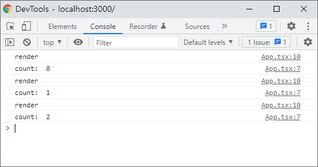
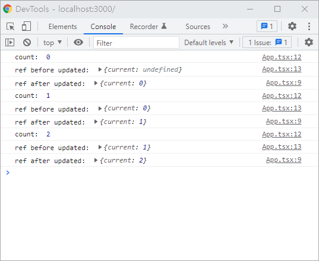
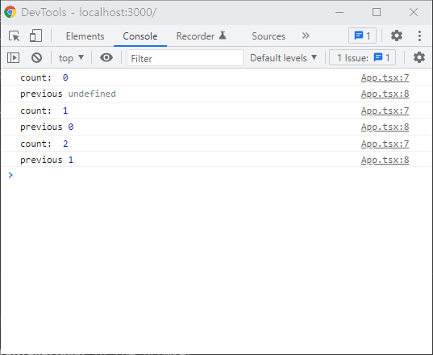

### useEffect

useEffect는 파라미터로 effect함수와 deps배열을 받는다.

컴포넌트가 mount 혹은 update 될때 deps배열에 따라 effect함수가 실행여부가 결정되는데, 이때 effect함수는 컴포넌트의 rendering이 끝난 뒤에 실행된다.

예를들어, 아래 코드에서 버튼을 누르면 console.log("render")과 re-rendering 이후에 effect함수의 console.log("count: ", count)가 실행되고나서 컴포넌트가 update된다.

```tsx
const Counter = () => {
  const [count, setCount] = useState(0)

  useEffect(() => {
    console.log("count: ", count)
  }, [count])

  console.log("render")
  return <button onClick={() => setCount(count + 1)}>{count}</button>
}
```



### useRef

useRef로 반환된 ref객체는 컴포넌트의 전 생애주기, 즉 mount부터 unmount까지 유지되며 state와 달리 값을 변경해도 컴포넌트가 update되지 않는다. 이런 이유로 useRef hook은 DOM을 제어하기 위한 수단 외에도 변경되어도 re-rendering되지 않아야 하는 가변값을 저장하기 위한 용도로도 쓰인다.

effect함수를 ref가 state나 props같은 상태를 저장하도록 선언하고 상태가 변경되어 update될때, re-rendering 이후에 effect함수가 실행되기 때문에 re-rendering과 effect함수 실행 이후에는 ref가 이전 상태를 저장하고 있게 된다.

```tsx
const Counter = () => {
  const [count, setCount] = useState(0)
  const ref = useRef<number>()

  useEffect(() => {
    ref.current = count
    console.log("ref after updated: ", ref)
  }, [count])

  console.log("count: ", count)
  console.log("ref before updated: ", ref)
  return <button onClick={() => setCount(count + 1)}>{count}</button>
}
```



### custom hook으로

로직을 뽑아내어 custom hook으로 만들 수 있다.

```tsx
function usePrevious<T>(value: T) {
  const ref = useRef<T>()
  useEffect(() => {
    ref.current = value
  })
  return ref.current
}

const Counter = () => {
  const [count, setCount] = useState(0)
  const previous = usePrevious(count)

  console.log("count: ", count)
  console.log("previous", previous)
  return <button onClick={() => setCount(count + 1)}>{count}</button>
}
```


