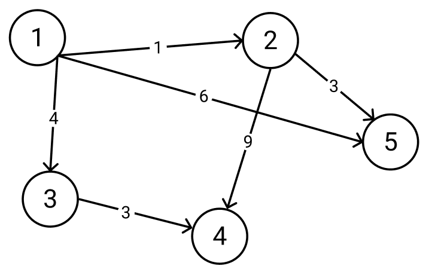
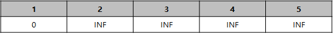
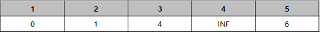
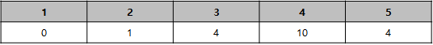
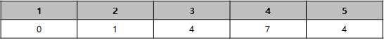

그래프의 최단거리를 구하는 여러 알고리즘들은 한 시작점에서 나머지 정점으로의 최단거리를 구하는 알고리즘과 모든 정점의 쌍에 대한 최단거리를 구하는 알고리즘으로 나눌 수 있다.

다익스트라 알고리즘은 한 시작점에서 나머지 정점으로 가는 최단거리를 구하는 전자에 해당되는 알고리즘이며 특정 경로의 가중치 합이 음수인 사이클인 음수사이클이 없는 그래프에서 동작한다.

### 동작과정



사진의 유향그래프가 주어졌을 때, 1번 정점에서 에서 각 정점으로 가는 최소비용은 다음 처럼 구할 수 있다.

1. 시작점인 1번 정점에서 1번 정점으로 가는 최소비용은 당연하게도 0이다. 그 외 다른 모든정점들은 아직 탐색하지 못했으므로 다른 정점까지의 최소비용을 INF로 설정한다. 1번 정점을 현재 정점이라고 하자.
   
   <br>
2. 현재 정점인 1번 정점은 2, 3, 5번 정점과 연결되어있다. 그 중 하나인 2번 정점에 대해서 보면, 지금까지 구한 시작점에서 2번 정점으로 가는 최소비용은 INF이지만 현재 정점에서 새로 알아낸 경로인 시작점에서 2번 정점으로 가는 경로의 비용이 1로 INF보다 작다. 따라서 2번 정점으로 가는 최소비용을 1로 업데이트한다. 3번과 5번 또한 현재 정점과 연결되어 있으므로 똑같이 적용시킬 수 있다.
   
   <br>
3. 탐색을 마친 1번 정점 외에 나머지 정점 중 가장 비용이 낮은 정점인 2번 정점을 현재정점으로 설정한다. 2번 정점과 연결된 4번, 5번 정점에 대해 최소비용을 갱신한다. 4번 정점에 대해선 시작점에서 현재정점으로 오는 비용 1과 현재 정점에서 4번 정점으로 가는 비용 9의 합인 10이 지금까지 구한 최소비용인 INF보다 작으므로 4번 정점으로 가는 최소비용을 10으로 갱신한다. 5번 정점 또한 시작점에서 현재 정점으로 오는 비용 1과 현재 정점에서 5번 정점으로 가는 비용 3의 합인 4가 지금까지 구한 최소비용인 6보다 작으므로 5번 정점으로 가는 최소비용을 4로 갱신한다.
   
   <br>
4. 탐색을 마친 1, 2번 정점 외에 나머지 정점 중 가장 비용이 낮은 정점은 3번 정점과 5번 정점이다. 어떤 정점을 선택해도 상관없지만 임의로 3번정점을 현재 정점으로 설정하고 현재 정점에서 연결된 4번정점에 대해 최소비용을 갱신한다. 시작점에서 현재정점으로 오는 비용 4와 현재 정점에서 4번 정점으로 가는 비용 3의 합인 7이 지금까지 구한 4가 지금까지 구한 최소비용인 10보다 작으므로 4번 정점으로 가는 최소비용을 7으로 갱신해준다.
   
   <br>
5. 탐색을 마친 1, 2, 3번 정점 외에 나머지 정점 중 가장 비용이 낮은 5번 정점을 현재정점으로 설정한다. 5번 정점은 더 나아갈 정점이 없으므로 탐색을 마친다.
6. 탐색을 마치지 않은 유일한 정점인 4번 정점 또한 더 나아갈 정점이 없으므로 탐색을 마친다.

따라서 위 예시 그래프에서 1번 정점에서 다른 정점까지의 최소거리는 아래와 같다.


### 구현

https://www.acmicpc.net/problem/5972

```cpp
#include <iostream>
#include <vector>
#include <queue>
#define INF 987654321
using namespace std;

int main() {
    int n, m;
    cin >> n >> m;
    vector<vector<pair<int, int>>> adj(n);
    vector<int> dist(n, INF);
    priority_queue<pair<int, int>, vector<pair<int, int>>, greater<pair<int, int>>> pq;
    dist[0] = 0;
    for(int i=0; i<m; i++) {
        int from, to, cost;
        cin >> from >> to >> cost;
        adj[from-1].push_back(make_pair(to-1, cost));
        adj[to-1].push_back(make_pair(from-1, cost));
    }
    pq.push(make_pair(0, 0));
    while(!pq.empty()) {
        int cost = pq.top().first;
        int here = pq.top().second;
        pq.pop();
        if(dist[here] < cost) continue;
        for(auto vertex: adj[here]) {
            int there = vertex.first;
            int nextCost = cost + vertex.second;
            if(dist[there] > nextCost) {
                dist[there] = nextCost;
                pq.push(make_pair(nextCost, there));
            }
        }
    }
    cout << dist[n-1] << endl;
}
```

1번 정점에서 n번 정점까지의 최단거리를 구하는 문제이다.

문제에서 주어진 그래프는 무향 그래프이기 때문에 모든 간선을 양방향으로 나누어 유향 그래프로 표현한다.

다익스트라는 우선순위 큐를 활용해 문제를 해결한다. 우선순위 큐에는 정점의 번호와 지금까지 구한 그 정점까지의 최단거리를 쌍으로 넣고 정점까지의 최단거리를 기준으로 정렬한다.

우선순위 큐는 일반적인 큐처럼 FIFO가 아니기 때문에 이전에 구했던 최단거리가 이후에는 더이상 최단거리가 아니게 될 수 있다. 따라서 만약 우선순위 큐의 top원소가 현재까지 구한 최단거리보다 긴 거리를 담고있으면 continue로 무시해야 한다.

### 경로찾기

추가로 그래프의 최단거리외에 최단경로를 찾는 경우가 있다. 이 경우 그래프를 탐색하는 과정에서 스패닝 트리를 계산하면 되는데, 이는 시작점을 제외한 각 정점의 부모 정점을 기록해 표현하면 된다.

```cpp
#include <iostream>
#include <vector>
#include <queue>
#define INF 987654321
using namespace std;

int main() {
    int n, m;
    cin >> n >> m;
    vector<vector<pair<int, int>>> adj(n);
    vector<int> dist(n, INF);
    vector<int> parents(n); // parent[i]는 정점 i의 부모 번호
    priority_queue<pair<int, int>, vector<pair<int, int>>, greater<pair<int, int>>> pq;
    dist[0] = 0;
    parents[0] = 0;
    for(int i=0; i<m; i++) {
        int from, to, cost;
        cin >> from >> to >> cost;
        adj[from-1].push_back(make_pair(to-1, cost));
        adj[to-1].push_back(make_pair(from-1, cost));
    }
    pq.push(make_pair(0, 0));
    while(!pq.empty()) {
        int cost = pq.top().first;
        int here = pq.top().second;
        pq.pop();
        if(dist[here] < cost) continue;
        for(auto vertex: adj[here]) {
            int there = vertex.first;
            int nextCost = cost + vertex.second;
            if(dist[there] > nextCost) {
                dist[there] = nextCost;
                parents[there] = here; // 최단거리가 갱신될 때 부모 번호도 갱신
                pq.push(make_pair(nextCost, there));
            }
        }
    }
    cout << dist[n-1] << endl;

    int cur = n-1;
    while(true) {
        cout << cur+1 << " ";
        if(cur == 0) break;
        cur = parents[cur];
    }
}
```
