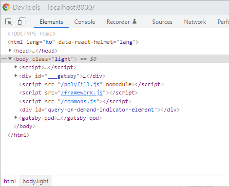

블로그에 다크모드를 적용시켜보았다.

### 플러그인 설치

[gatsby-plugin-dark-mode](https://www.gatsbyjs.com/plugins/gatsby-plugin-dark-mode/)는 다크모드 적용을 도와주는 gatsby 플러그인이다. light, dark 등 현재 설정된 모드를 body태그의 class로 적용시키고 그 설정된 테마를 브라우저의 localStorage에 저장해 홈페이지를 나갔다 다시 들어와도 마지막에 설정되어있던 테마를 그대로 사용할 수 있도록 도와주는 역할을 한다.

플러그인을 사용하기 위해선 gatsby-config.js에 등록시켜주어야 한다.

```js
// gatsby-config.js

module.exports = {
  plugins: ["gatsby-plugin-dark-mode"],
}
```

### 다크모드 버튼 만들기

```jsx
import React from "react"
import { ThemeToggler } from "gatsby-plugin-dark-mode"

class MyComponent extends React.Component {
  render() {
    return (
      <ThemeToggler>
        {({ theme, toggleTheme }) => (
          <label>
            <input
              type="checkbox"
              onChange={e => toggleTheme(e.target.checked ? "dark" : "light")}
              checked={theme === "dark"}
            />{" "}
            Dark mode
          </label>
        )}
      </ThemeToggler>
    )
  }
}
```

위 코드는 gatsby-plugin-dark-mode 플러그인의 공식문서에서 제공하는 ThemeToggler의 예시이다. ThemeToggler 컴포넌트의 자식으로 theme와 toggleTheme 함수를 인자로 받은 function component를 두었다. 여기서 theme는 현재 테마의 이름을 의미하고, toggleTheme 함수로 theme를 변경할 수 있다고 한다.

```tsx
//ThemeToggleButton.tsx

import React from "react"
import { ThemeToggler } from "gatsby-plugin-dark-mode"
import { MdLightMode, MdDarkMode } from "react-icons/md"

interface ThemeTogglerProps {
  theme: string
  toggleTheme: (theme: string) => void
}

const ThemeToggleButton = () => {
  return (
    <ThemeToggler>
      {({ theme, toggleTheme }: ThemeTogglerProps) => (
        <label className="theme-toggler">
          <input
            type="checkbox"
            onChange={e => toggleTheme(e.target.checked ? "dark" : "light")}
            checked={theme === "dark"}
          />
          {theme === "dark" ? <MdLightMode /> : <MdDarkMode />}
        </label>
      )}
    </ThemeToggler>
  )
}
```

공식문서의 예시를 본따 ThemeToggler를 만들고 typescript로 마이그레이션 했다. 공식문서 예시에서 버튼에 단순히 Dark Mode라고 적혀있는 부분도 너무 밋밋해서 현재 설정된 모드에 따라 알맞는 아이콘이 나오도록 만들었다.

적용 후 체크박스를 클릭하면 body태그의 class가 light 혹은 dark로 변하면서 label태그의 아이콘 또한 변경됨을 확인할 수 있다.


```css
.theme-toggler {
  display: flex;
  position: fixed;
  bottom: 1.5rem;
  right: 1.5rem;
  width: 50px;
  height: 50px;
  border-radius: 50px;
  background-color: #cacaca;
}

body.light .theme-toggler {
  box-shadow: 2px 1px 3px 1px rgba(0, 0, 0, 0.5);
}

body.dark .theme-toggler {
  box-shadow: inset 2px 1px 3px 1px rgba(0, 0, 0, 0.5);
}

.theme-toggler input {
  all: unset;
}

.theme-toggler svg {
  margin: auto;
  color: #1d2632;
  font-size: 1.728rem;
}
```

ThemeToggler에 스타일도 적용시켜주었다. checkbox의 style을 직접 변경하는것은 불가능하기 때문에 checkbox를 비활성화 시키고 label태그의 스타일을 커스텀하는 방식으로 checkbox의 style을 변경하는 효과를 낼 수 있다. input태그 style에 all: unset을 적용해 checkbox가 보이지 않도록 하고 label태그를 의미하는 .theme-toggler에 스타일을 적용시켜주었다.

position을 fixed로 설정해 스크롤, 화면넓이와 상관없이 항상 viewport 오른쪽 하단에 위치하도록 설정했다. 또한 dark모드와 light모드에 각각 반대의 shadow를 적용시켜 light모드에서는 튀어나온 느낌을 주고 반대로 dark모드에서는 들어간 느낌을 주었다. 그 외에도 필요한 여러 style 속성들을 적용시켜 아래와 같은 버튼을 만들었다.


### css variable

버튼을 만들었으니 남은것은 테마에 따라 나머지 요소들의 색상이 변하도록 하는 것이다. [css variable](https://developer.mozilla.org/ko/docs/Web/CSS/Using_CSS_custom_properties)을 사용해 body태그의 class 상태에 따라 css 변수를 재정의하고 이를 통해 하위 요소들에서 색상을 변경시킬 수 있다.

```css
body.light {
  --color-primary: #1d2632;
  --color-text: #000000;
  --color-background: #ffffff;
}

body.dark {
  --color-primary: #ffffff;
  --color-text: #cacaca;
  --color-background: #1d2632;
}

body {
  color: var(--color-text);
  background-color: var(--color-background);
}

.element {
  background-color: var(--color-primary);
}
```

위 코드의 경우 body태그에 class로 light가 적용되었을 때와 dark가 적용되었을 때 각각의 모드에서 사용되는 색상들을 css변수에 정의했다. 모드가 바뀌면서 css변수에 담긴 값이 달라지고 하위요소들에 적용된 색상또한 변경된다.

예시로, 위 css코드에서 body태그의 경우 background-color로 할당된 --color-background 변수가 light모드에서는 #ffffff(하얀색), dark모드에서는 #1d2632(남색)으로 정의되기 때문에 light모드에서는 하얀바탕, dark모드에서는 남색바탕을 띄게 된다.

이 방식을 활용해 사이트 전체의 css에 dark테마와 light테마 각각의 색상을 손쉽게 적용시킬 수 있다.
