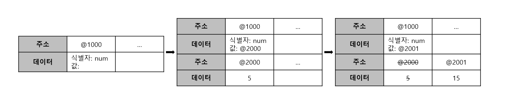
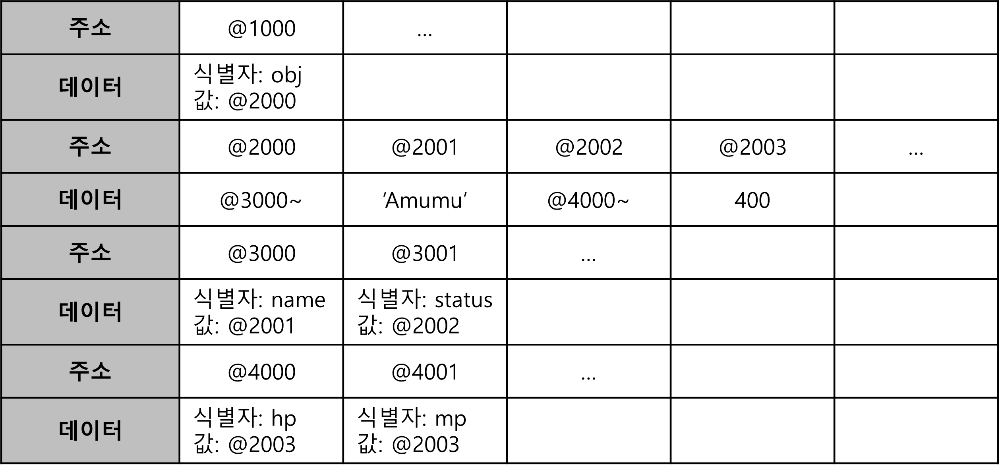

변수 선언시 변수의 자료형을 정의하는 다른 많은 프로그래밍 언어들과 달리, 자바스크립트는 자료형 대신 var이나 let, const 키워드로 변수를 선언하고, 변수에 number, string같은 원시자료형부터 객체나 배열같은 참조 자료형까지 자유롭게 대입, 변환이 가능하다.

자바스크립트는 이런 동작을 효율적으로 하기위해 데이터를 보다 특별한 방식으로 저장한다.

### 원시자료형

```
var num
num = 5
num = 15
```



1. 첫 번째 줄에서 변수 num이 선언되었다. 이때 자바스크립트는 메모리에서 빈 공간 @1000을 확보해 식별자를 num이라고 저장한다.
2. 두 번째 줄에서 num에 5를 할당했다. 숫자 5를 @2000에 저장하고 이 주소를 @1000에 저장한다.
3. 세 번째 줄에서 num이 15로 바뀌었다. 숫자 15를 @2001에 저장하고 이 주소를 @1000에 덮어쓴다. @2000의 숫자 5는 어떤 변수도 참조하지 않아 더 이상 필요가 없기때문에 GC에 의해 사라진다.

### 참조자료형

```
var obj = {
  name: 'Amumu',
  level: 3
}
```


1. 객체 obj가 선언되었다. 빈공간 @1000을 할당해 식별자를 obj로 저장한다.
2. obj의 여러 프로퍼티를 저장하기 위해 빈공간 @3000과 @3001을 할당해 식별자 name과 level로 저장하고 프로퍼티들이 저장된 영역의 주소(@3000~)을 @2000에 저장한다.
3. 'Amumu'를 @2001에 저장하고 이 주소를 @3000에 저장한다.
4. 똑같이 3을 @2002에 저장하고 이 주소를 @3001에 저장한다.

```
var obj = {
  name: 'Amumu',
  status: {
    hp: 400,
    mp: 400
  }
}
```

참조자료형 데이터의 내부 프로퍼티로 참조자료형 데이터를 할당하는 경우엔 한단계 더 복잡하다.



1. 객체 obj가 선언되었다. 빈공간 @1000을 할당해 식별자를 obj로 저장한다.
2. obj의 여러 프로퍼티를 저장하기 위해 빈공간 @3000과 @3001을 할당해 식별자 name과 status로 저장하고 프로퍼티들이 저장된 영역의 주소(@3000~)을 @2000에 저장한다.
3. 'Amumu'를 @2001에 저장하고 이 주소를 @3000에 저장한다.
4. status의 여러 프로퍼티를 저장하기 위해 빈공간 @4000과 @40001을 할당해 식별자 hp와 mp로 저장하고 프로퍼티들이 저장된 영역의 주소(@4000~)을 @2002에 저장, @2002를 @3001에 저장한다.
5. 400을 @2003에 저장하고 이 주소를 @4000에 저장한다.
6. 400이 이미 @2003에 선언되어 있기 때문에 새로운 빈 공간을 할당하기 대신 @4001에 주소 @2003을 저장한다.

### 왜 이렇게 하는걸까

변수에 정수 5를 대입하는 간단한 과정도 나름 복잡하게 이루어졌다. 왜일까?

1. 자유로운 데이터 변환
   숫자, 문자열, 객체 등 여러 자료형의 데이터들이 필요로 하는 메모리 용량은 모두 각각 다르다. 변수가 데이터의 참조값을 저장하지 않고 데이터 자체를 저장하게 되면, 작은 크기의 데이터가 큰 크기의 데이터로 바뀌었을때 부족한 메모리 용량을 만들기 위해 변환된 데이터 크기만큼 shift해야 되게 되고 매우 느려질 수 밖에 없다.
   이는 변수가 데이터의 자료형에 상관없이 대입되고 바뀌는 자바스크립트의 변수에 적절치 못하다.

2. 효율적인 메모리 관리
   위의 참조형 데이터 내부에 참조형 데이터가 있었던 중첩객체의 예시 6번 과정에서는 정수 400이 이미 주소 @2001에 저장되어 있기 때문에 이를 재활용했었다. 비슷한 예를 들어 한 똑같은 데이터를 여러 변수가 이용하는 상황, 예를 들어 변수 5만개를 선언하고 5만개 모두 100을 할당할 때, 변수에 데이터 100를 참조하지 않고 100 그 자체를 저장하게 된다면 (데이터 100의 크기 50000) 만큼의 데이터 용량이 필요하고 반대로 5만개의 변수 모두가 데이터 100을 참조하게 된다면 필요한 데이터 용량은 (주소값의 크기 50000 + 데이터 100의 크기)이 된다.
   일반적으로 주소값의 크기는 데이터의 크기보다 작으므로 후자의 경우가 필요로 하는 데이터 용량이 전자보다 작다. 이 처럼 변수가 데이터를 참조하는 방식은 중복된 데이터에 대해 용량 크기 측면에서 효율을 높여준다.
