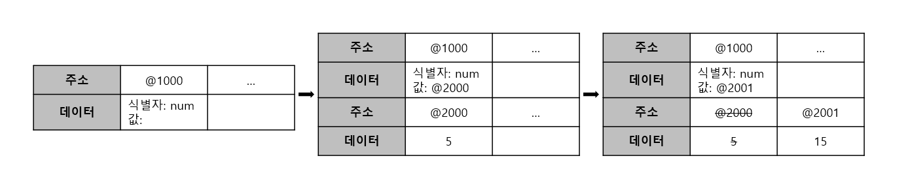
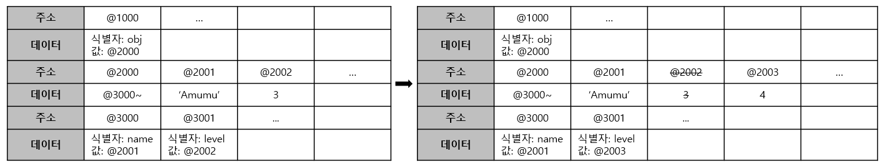
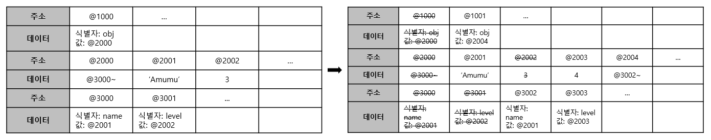

불변성의 사전적의미는 말그래로 상태가 변하지 않음을 의미한다.

사전적 의미는 간단하지만 그에비해 이 개념을 처음 접할때 이해가 쉽지 않다. 그러나 자바스크립트에서 객체를 변경하거나 복사, 비교하는 등의 동작 거의 대부분에 사용되는 개념이라 React같은 라이브러리에서도 중요하게 다루고 있기 때문에 모르면 '이게 왜 안돼?'를 유발할 수 있는 중요한 개념이다.

### 불변성

자바스크립트에서 number같은 원시자료형의 값이 변경될 때 동작하는 방식을 살펴보자.

```
var num
num = 5
num = 15
```



사진에서 알 수 있듯이 변수 num이 5에서 15로 바뀔 때 주소 @1000이 참조하고 있는 주소가 @2000에서 @2001로 대체된 것을 알 수 있다.

여기서 주목할 점은 num이 참조하고 있던 기존 5라는 데이터는 지워지고 15라는 데이터로 새로 덮어쓰기 되어서 num이 가르키고 있는 값이 5에서 15로 변경된 뿐 만 아니라 num이 참조하고 있는 주소 또한 변경되었다는 점이다.

즉, 우리는 위 코드로 5를 변경한 것이 아니라 5는 지워지고 15로 대체 한 것이며, 5라는 데이터의 상태가 변경되지 않았고 그대로 5였기 때문에 우리는 num을 15로 변경할 때 불변성을 만족시키며 데이터를 바꾼 셈이다.

사실 원시자료형의 데이터는 값을 객체처럼 더이상 쪼갤 수 없고 따라서 값을 변경하려면 위 예시처럼 새로운 값으로 대체하는 수 밖에 없기 때문에 원시자료형 데이터의 변경은 모든 경우에서 불변성을 만족한다.

그러나 객체의 경우 불변성을 만족하지 않은 채 상태를 변경시킬 수 있다.

```
var obj = {
  name: 'Amumu',
  level: 3
}
obj.level = 4
```



obj의 프로퍼티 level이 3에서 4로 변경되었다.

이때 @3001에 위치한 obj.level은 원시자료형 number이고 불변성을 만족하며 변경되었지만, @1000에 위치한 객체 obj가 참조하고 있는 주소는 obj.level 변경 전후 모두 @2000로 같다.

obj.level이 변경되어 obj는 상태가 변경되었으므로 불변성을 만족하지 못했다고 할 수 있다.

### 불변객체

객체를 불변성을 만족시키며 내부 프로퍼티를 변경하기 위해서는 새로운 객체를 만들어 재할당 하면 된다.

```
var obj = {
  name: 'Amumu',
  level: 3
}

obj = {
  name: 'Amumu',
  level: 4
}
```



obj의 프로퍼티를 변경한 것이 아닌 obj 데이터 자체를 새로운 객체를 만들어 재할당했다.

기존 obj가 저장되어있던 @1000의 데이터와 참조되던 데이터들 중 더이상 필요없는 데이터는 GC에 의해 제거되고 @1001에 새로운 객체 obj가 저장되었다. 객체 obj는 새로운 데이터로 할당된 것이지, 상태가 변경된 것이 아니기 때문에 불변성을 만족했다고 할 수 있다.

#### 변수 복사

불변성을 지키지 않고 변수를 복사하면 원본과 복사된 사본이 모두 같은 주소를 참조한다.

```
var obj = {
  name: 'Amumu',
  level: 3
}

var copiedObj = obj
copiedObj.name = 'Teemo'

console.log(obj.name, copiedObj.name) // 'Teemo', 'Teemo'
console.log(obj === copiedObj) // true
```

이는 객체같은 참조자료형 데이터를 불변성을 지키지 않은 채 복사했을때 원본을 바꾸면 사본이 바뀌고, 사본을 바꾸면 원본이 바뀌도록 동작한다.

```
const copyObj = (target) => {
  return {...target}
}

var obj = {
  name: 'Amumu',
  level: 3
}

var copiedObj = copyObj(obj)

copiedObj.name = 'Teemo'

console.log(obj.name, copiedObj.name) // 'Amumu', 'Teemo'
console.log(obj === copiedObj) // false
```

그러나 불변성을 지킨 불변객체의 경우 원본과 사본이 참조하는 주소가 다르기 때문에 서로 값이 바뀌어도 서로 영향을 주지 않는다.

#### 얕은 비교

얕은 비교는 객체를 비교할 때, 객체가 가진 프로퍼티들의 값은 상관 없이 객체가 참조하고 있는 주소만을 비교하는 비교방법이다.

```
var objA = {
  name: 'Amumu',
  level: 3
}

var objB = {
  name: 'Amumu',
  level: 3
}

console.log(objA === objB) // false
```

예를들어, 위 코드에서 objA와 objB는 서로 가지고있는 프로퍼티가 같지만, 서로 다른 주소를 참조하고 있기 때문에 비교연산자가 false를 반환한다.

얕은 비교는 객체를 비교함에 있어 계산 리소스를 줄여줄 뿐 만 아니라 객체의 프로퍼티가 다른 객체와 서로 참조해 사이클을 이루어 무한한 깊이를 가질때에도 비교를 할 수 있게 해준다.
