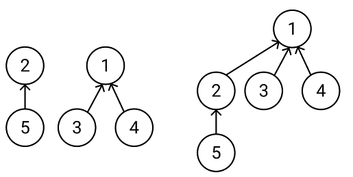

### 유니온 파인드

유니온 파인드는 상호 배타적 집합(disjoint set)을 효율적으로 표현하는데 사용되는 자료구조이다. 유니온 파인드가 상호 배타적 집합을 표현, 저장하기 위해서는 다음의 연산들을 필요로 한다.

<ul>
<li>Find: 어떤 원소가 주어졌을 때 해당 원소가 어떤 집합에 속해있는지 판단</li>
<li>Union: 두 원소가 주어졌을 때 두 원소가 속합 집합들을 하나로 병합</li>
</ul>

상호 배타적 집합을 가장 간단하게 표현하는 방법은 1차원 배열이다. 예를들어 상호 배타적 집합을 표현하는 집합 arr이 있을 때 arr[i]가 원소 i가 속한 집합의 고유번호라고 정의하게 되면 상수시간 안에 원소가 어떤 집합에 속해있는지 판단할 수 있다.


또한 두가지 연산을 효율적으로 하기위해 상호 배타적 집합을 트리로 표현한다. 예를들어, 1번 정점과 2번 정점을 연결할 때 두 정점이 연결됬음을 표현하기 위해 1번 정점을 2번 정점의 부모노드로 설정한다. 또한 유니온 파인드 배열에 저장되는 집합의 고유번호를 트리의 루트 번호로 설정해 find 연산을 해당 정점이 포함된 트리의 루트를 찾는 것으로 구현하고 union 연산은 find연산을 통해 트리의 루트 정점을 얻어 루트 정점의 부모를 변경하는 것으로 구현할 수 있다.

위 방식을 통해 find연산과 union연산은 트리의 높이에 비례하는 시간이 걸리게 된다.

#### 초기화

배열 arr에 대해 arr[i] = i로 초기화한다. arr[i]가 i인 경우, i번째 정점이 i가 속한 트리의 루트라는 의미를 갖게된다.

```cpp
vector<int> arr(size)
for(int i=0; i<size; i++) arr[i] = i;
```

#### find

find 연산을 통해 트리의 루트 번호를 구해야 한다. 이를 위해 재귀적으로 정점의 부모노드로 올라가면서 탐색한다.

```cpp
int find(int idx, vector<int>& disjointSet) {
    if(disjointSet[idx] == idx) return idx;
    else return find(disjointSet[idx], disjointSet);
}
```

#### union

union은 c/c++에서 예약어이기 때문에 함수명을 merge로 설정했다. union연산은 두 정점이 속한 트리의 루트들을 구하고 두 정점이 서로 다른 트리에 속한 경우, 한 트리의 루트가 부모노드로 다른 트리의 루트를 가지도록 설정한다.

```cpp
void merge(int idxA, int idxB, vector<int>& disjointSet) {
    int rootA = find(idxA, disjointSet);
    int rootB = find(idxB, disjointSet);
    if(rootA == rootB) return;
    else disjointSet[rootA] = rootB;
}
```

### 최적화

앞서 말했듯 find연산과 union연산은 트리의 높이에 비례하는 시간이 걸리게 된다. 위에서 구현한 find와 merge함수는 잘 작동하지만 트리가 한쪽으로 기울어지게되면 최악의 경우 O(n)까지 효율이 낮아질 수 있다. 유니온 파인드에서 설정한 트리구조는 트리의 루트를 구하는 것이 유일한 목적임을 이용해서 트리의 구조를 최적화 할 수 있다.

#### find

find 연산에서 경로 압축 최적화를 이용해 수행시간을 줄일 수 있다.

기존의 find 연산은 수행 마다 중복된 계산을 수행하게 된다. 이에 착안해서 find(v)를 통해 v의 루트를 찾아냈다고 할 때, v에서 트리의 루트로 가는 경로상의 모든 정점들에 대해서 정점들의 부모노드를 루트로 바꾸면 다음 호출에서는 경로를 따라 올라갈 것 없이 바로 루트를 찾을 수 있도록 할 수 있다.

```cpp
int find(int idx, vector<int>& disjointSet) {
    if(disjointSet[idx] == idx) return idx;
    else return disjointSet[idx] = find(disjointSet[idx], disjointSet);
}
```

#### union

union 연산에서도 트리가 한쪽으로 기울어지는 것을 방지함으로서 수행시간을 줄일 수 있다.

트리의 루트가 i일때 해당 트리의 높이를 rank[i]에 저장하는 배열 rank를 만든 후, 두 노드를 병합할 때마다 높이가 더 낮은 트리를 높은 트리의 서브트리로 편입시키는 방식으로 최적화해 수행시간을 줄일 수 있다.

```cpp
vector<int> rank(size)
for(int i=0; i<size; i++) rank[i] = 1;

void merge(int idxA, int idxB, vector<int>& disjointSet) {
    int rootA = find(idxA, disjointSet);
    int rootB = find(idxB, disjointSet);
    if(rootA == rootB) return;
    else {
        if(rank[idxA] > rank[idxB]) swap(idxA, idxB);
        disjointSet[rootA] = rootB;
        if(rank[idxA] > rank[idxB]) rank[idxB]++;
    }
}
```
