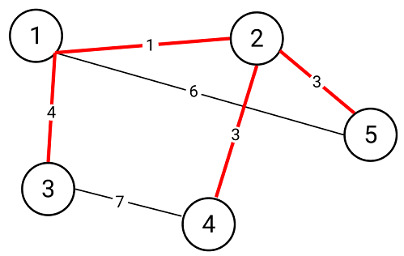

### 최소신장트리



최소신장트리(minimum spanning tree)는 모든 정점들을 가장 적은수, 최소 비용으로 연결한 트리이다. 최소신장트리는 아래와 같은 특징을 가지고 있다.

<ol>
    <li>n개의 정점을 n-1개의 간선으로 연결</li>
    <li>연결된 간선이 최소비용을 이루어야 함</li>
    <li>사이클을 이루지 않음</li>
</ol>

### 크루스칼 알고리즘

크루스칼 알고리즘은 최소 스패닝 트리를 구하는 알고리즘이다. 크루스칼 알고리즘은 아래 과정을 따른다.

<ol>
    <li>그래프의 간선들을 가중치가 적은 순서대로 정렬</li>
    <li>정렬된 간선들에 대해 가중치가 적은 간선부터 아래 과정을 거침</li>
    <ul>
        <li>현재 간선이 연결됬을 때 사이클이 생기면 해당 간선은 무시</li>
        <li>현재 간선이 연결되어도 사이클이 생기지 않으면 해당 간선 연결</li>
    </ul>
</ol>

크루스칼 알고리즘에서는 간선을 연결했을 때 사이클의 생성 여부를 판단해야 한다. 연결하려는 두 정점이 같은 상호 배타적 집합에 속해있다면 해당 간선이 연결되었을 때 사이클이 생기게 되는데 이는 [유니온파인드](https://skd6150.github.io/%EC%9C%A0%EB%8B%88%EC%98%A8%ED%8C%8C%EC%9D%B8%EB%93%9C/)를 이용하면 효율적으로 판단할 수 있다.

[백준 1197](https://www.acmicpc.net/problem/1197)

```cpp
#include <iostream>
#include <algorithm>
#include <vector>
using namespace std;

struct edge {
    int from, to, cost;
};

bool cmp(edge a, edge b) {
    return a.cost < b.cost;
}

int find(int idx, vector<int>& parents) {
    if(parents[idx] == idx) return idx;
    return parents[idx] = find(parents[idx], parents);
}

void merge(int idxA, int idxB, vector<int>& parents) {
    int parentA = find(idxA, parents);
    int parentB = find(idxB, parents);
    if(parentA == parentB) return;
    else parents[parentA] = parentB;
}

int main() {
    int v, e, result = 0;
    cin >> v >> e;
    vector<int> parents(v+10);
    vector<edge> edges;
    for(int i=1; i<=v; i++) parents[i] = i;
    for(int i=0; i<e; i++) {
        edge tmp;
        cin >> tmp.from >> tmp.to >> tmp.cost;
        edges.push_back(tmp);
    }
    sort(edges.begin(), edges.end(), cmp);
    for(edge cur: edges) {
        if(find(cur.from, parents) == find(cur.to, parents)) continue;
        else {
            result += cur.cost;
            merge(cur.from, cur.to, parents);
        }
    }
    cout << result << endl;
}
```
